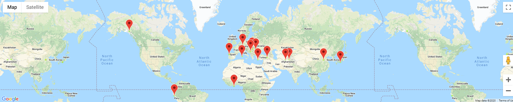

# API-Weather_Analysis_and_Mock_Vacation_Planning_with_OpenWeatherMapAPI

## Weather Analysis

This Python script uses  the CitiPy library and the OpenWeatherMapAPI to visualize the weather of 500+ random cities across the world of varying distance from the equator via scatter plots. A print log is displayed as each city is being processed with the city number and city name. All retrieved data is saved as a CSV and each scatter plot is saved as a PNG.

This script creates the following plots:
* Temperature (F) vs. Latitude
* Humidity (%) vs. Latitude
* Cloudiness (%) vs. Latitude
* Wind Speed (mph) vs. Latitude
* Northern Hemisphere - Temperature (F) vs. Latitude w/ Linear Regression
* Southern Hemisphere - Temperature (F) vs. Latitude w/ Linear Regression
* Northern Hemisphere - Humidity (%) vs. Latitude w/ Linear Regression
* Southern Hemisphere - Humidity (%) vs. Latitude w/ Linear Regression
* Northern Hemisphere - Cloudiness (%) vs. Latitude w/ Linear Regression
* Southern Hemisphere - Cloudiness (%) vs. Latitude w/ Linear Regression
* Northern Hemisphere - Wind Speed (mph) vs. Latitude w/ Linear Regression
* Southern Hemisphere - Wind Speed (mph) vs. Latitude w/ Linear Regression

## Mock Vacation
Using  Jupyter-Gmaps and Google Places API this script will create a heat map that displays the humidity for every city used from the WeatherPy Analysis. This script then narrows down the locations to ones with ideal weather conditions:
* A max temperature lower than 80 degrees but higher than 70.
* Wind speed less than 10 mph.
* Zero cloudiness.

This script then uses Google Places API to find the first hotel for each city located within 5000 meters of the cities coordinates and then plots the hotels on top of the humidity heatmap with each pin containing the **Hotel Name**, **City**, and **Country**.

### Tech Stack
* Python
* OpenWeatherMap API Key

### User Instructions
* Clone the repository: git clone https://github.com/DarrylB32/API-Weather_Analysis_and_Mock_Vacation_Planning_with_OpenWeatherMapAPI
* Open and execute [WeatherPy](WeatherPy/WeatherPy.ipynb) file.
* Open and execute [VacationPy](VacationPy/VacationPy.ipynb) file.

### Additional Notes
Updates will be made so that individuals may input their own "Ideal Weather" criteria. 
